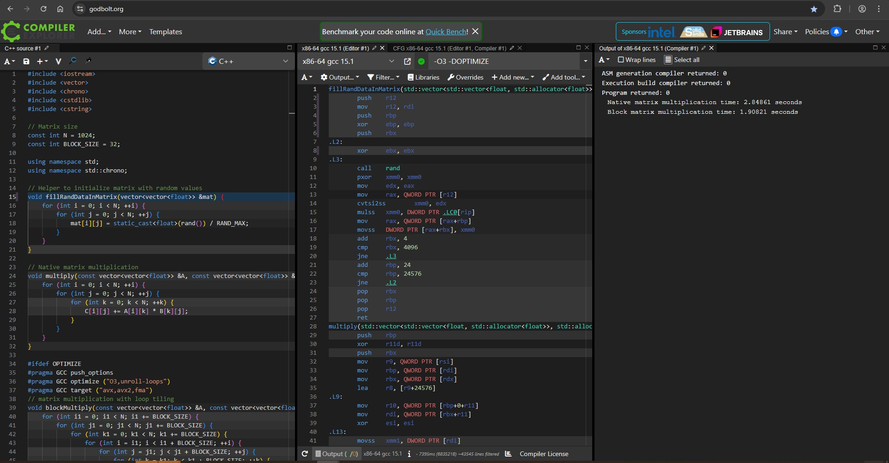
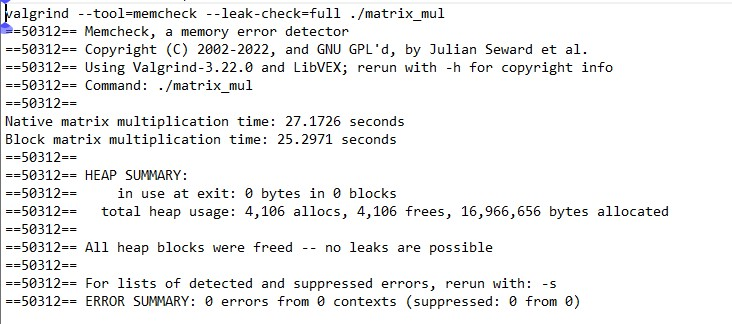
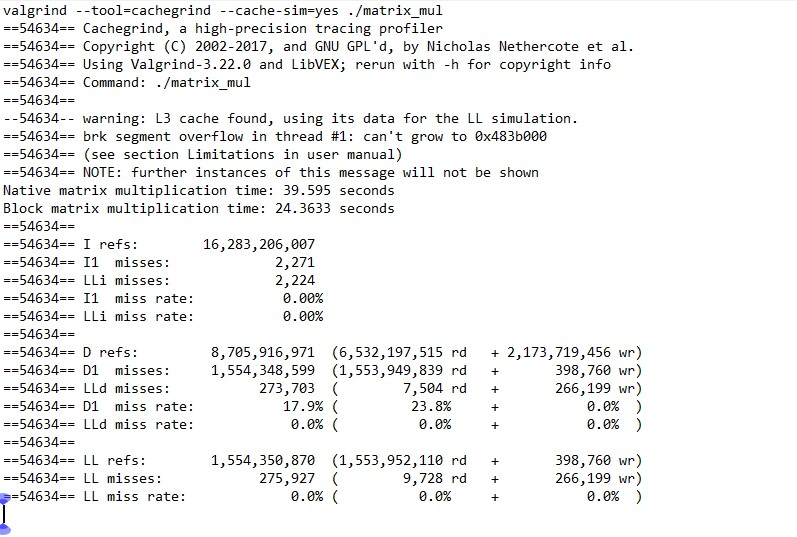

## [x86_64] Compilation with GCC and its performance

---

g++ matrix_mul.cpp -O3 -DOPTIMIZE -o matrix_mul  
./matrix_mul  
Native matrix multiplication time: 0.877995 seconds  
Block matrix multiplication time: 0.327794 seconds  

./matrix_mul  
Native matrix multiplication time: 0.888276 seconds  
Block matrix multiplication time: 0.327282 seconds  

./matrix_mul  
Native matrix multiplication time: 0.869065 seconds  
Block matrix multiplication time: 0.319789 seconds  

./matrix_mul  
Native matrix multiplication time: 0.885865 seconds  
Block matrix multiplication time: 0.325763 seconds  

./matrix_mul  
Native matrix multiplication time: 0.885918 seconds  
Block matrix multiplication time: 0.329239 seconds

g++ matrix_mul.cpp -O3 -fanalyzer -DOPTIMIZE -o matrix_mul  
./matrix_mul  
Native matrix multiplication time: 0.880518 seconds  
Block matrix multiplication time: 0.328612 seconds  

---

## [x86_64] Online compilation with GCC and its performance

---

---

## [x86_64] Memory check using valgrind tool

---

---

## [x86_64] Cache check using valgrind tool

---

---
